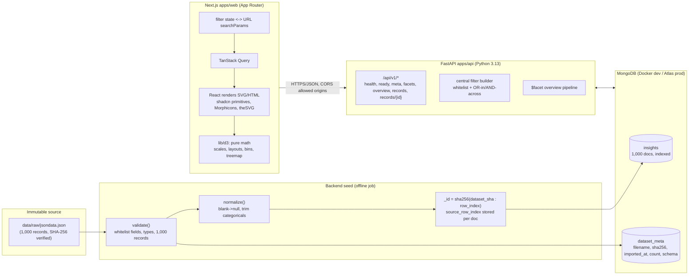

# Architecture — InsightScope: Global Intelligence Dashboard

Technical source of truth. Document version: 1.0 (Phase 0).
This document governs where files belong and how components interact. Changes require an
intentional update to this document (change control).

---

## 1. High-Level System Architecture



The browser never touches `jsondata.json`. All dashboard data flows:
`jsondata.json -> validation/normalization -> MongoDB -> FastAPI -> Next.js -> D3 visualizations`.

## 2. Request/Data Flow

1. **Seed (operator)**: `uv run python -m app.seed --source data/raw/jsondata.json` validates the
   full dataset against invariants (record count, field whitelist, value types, no unexpected
   structures). On any failure it aborts **without touching the database**. On success it
   computes SHA-256, upserts all normalized documents by deterministic `_id`, deletes documents
   whose ids are absent from the source, and replaces `dataset_meta` (single metadata doc).
   Idempotent by construction.
2. **Dashboard load (browser)**: page mounts -> TanStack Query fetches `/meta` (dataset status)
   and `/ready` (connectivity) once, then `/facets` + `/overview` + `/records?page=1` for the
   current URL filter state.
3. **Filter change**: URL searchParams are updated (no reload) -> active query keys change ->
   `/facets`, `/overview`, `/records` refetch in parallel -> React re-renders chart elements from
   pure D3 calculations.
4. **Record open**: `/records/{id}` fetched lazily -> detail Sheet renders; original URL is an
   external link only.

## 3. Database Design

### 3.1 Collections

**`insights`** — one primary collection. One document per source record.

- `_id`: deterministic string, `sha256("<dataset_sha256>:<source_row_index>")` hex. Identity is
  derived from the source dataset version plus the original row index — repeated seeding is
  idempotent, duplicated URLs or content can never collapse, future normalization-rule changes
  do not change record identity, and a different source dataset version produces a different
  identity namespace. Never Mongo auto-generated IDs, never URL, never title.
- Every document stores `source_row_index` (int) and `source_dataset_sha256` (str) alongside
  all 17 source fields with normalized values (blank -> null).
- Field value shapes:
  - categorical (`topic`, `sector`, `region`, `country`, `pestle`, `source`, `title`, `insight`, `url`): string or null;
  - numeric (`intensity`, `likelihood`, `relevance`, `end_year`, `start_year`, `impact`): int or null (never 0-for-missing, never float-converted);
  - datetime strings (`added`, `published`): preserved verbatim as source strings; display formatting is a frontend concern.
- No extra fabricated fields. City/SWOT are **not** added as columns.

**`dataset_meta`** — a single document (`_id: "current"`):

```json
{
  "_id": "current",
  "source_filename": "jsondata.json",
  "source_sha256": "f45b67f7...",
  "imported_at": "2026-09-08T...Z",
  "document_count": 1000,
  "schema": {
    "fields": ["end_year", "intensity", "...", "likelihood"],
    "field_availability": { "city": false, "swot": false, "intensity": true, "...": true },
    "populated": { "intensity": 962, "country": 350, "...": 1000 }
  }
}
```

### 3.2 Indexes

One index per frequently filtered field (single-field, ascending):

`end_year`, `topic`, `sector`, `region`, `pestle`, `source`, `country`, plus `start_year`,
`intensity`, `likelihood`, `relevance` (used by numeric range filters and sorting).

No compound indexes, no text indexes: 1,000 documents; the `$match` stage is selective and any
compound index combination would be premature optimization. Documented decision; revisit only
with measured evidence.

## 4. Normalized Data Behavior (canonical rules)

| Source value | Stored value |
| --- | --- |
| `""` (blank string, any field) | `null` |
| `"  text  "` categorical | trimmed string (e.g. `"CNBC "` -> `"CNBC"`) |
| int values in numeric fields | int as supplied (preserved exactly) |
| `"World"` vs `"world"` region | preserved as two distinct supplied values (no case folding) |
| extreme `end_year` (2126, 2200) | preserved as supplied |
| `added`/`published` strings | preserved verbatim |

Rules rationale: the assignment forbids inventing or correcting data. Whitespace trimming is the
only permitted normalization (sanctioned by the data quality rules); case-folding is not applied
so the 23 unique region values of the raw file remain intact.

## 5. API Design (FastAPI, versioned `/api/v1`)

All endpoints return JSON. Errors: `{"error": {"code": "...", "message": "..."}}` with an
appropriate HTTP status; internal exception details are logged server-side and never echoed.

| Endpoint | Purpose |
| --- | --- |
| `GET /api/v1/health` | Process liveness only. `200 {"status":"ok"}`. Does not touch Mongo. |
| `GET /api/v1/ready` | `ping` MongoDB. `200 {"status":"ready"}` or `503`. |
| `GET /api/v1/meta` | Dataset metadata: count, sha256, imported_at, schema fields, per-field availability + populated counts, `city.available=false`, `swot.available=false`. |
| `GET /api/v1/facets?<filters>` | Filter options with counts, scoped by other active filters (see 6.2). |
| `GET /api/v1/overview?<filters>` | Single `$facet` aggregate payload (see 7). |
| `GET /api/v1/records?<filters>&page=1&page_size=25&sort=source_row_index&order=asc&q=` | Paginated filtered records. |
| `GET /api/v1/records/{id}` | Single record by deterministic `_id`. `404` if unknown. |

### 5.1 Filter query parameters (shared by facets/overview/records)

All filter parameters are **repeated query params** (`?topic=oil&topic=gas`). Numeric
ranges use `_min`/`_max` suffixes (`intensity_min=5&intensity_max=20`).

- Categorical: `topic`, `sector`, `region`, `pestle`, `source`, `country` — repeated
  values combine with OR within the field.
- Year lists: `end_year`, `start_year` — repeated comma-free ints.
- Ranges: `intensity_min`, `intensity_max`, `likelihood_min`, `likelihood_max`,
  `relevance_min`, `relevance_max`.
- Search: `q` — free text matched case-insensitively against `title`, `insight`,
  `topic`, `sector`, `source`, `country`, `region` using escaped-regex matching
  (max 100 chars).
- Pagination (records only): `page` (default 1, ≥1), `page_size` (default 25, max 100),
  `sort` (whitelist below), `order` (`asc`/`desc`).

### 5.2 Validation

- `FilterSpec` + `PaginationSpec` (FastAPI dependencies) parse and validate every
  parameter: known field names only, non-negative bounded page/pageSize (default 25,
  max 100), int year lists, numeric ranges with min ≤ max, sort whitelist.
- Sort whitelist: `source_row_index`, `end_year`, `start_year`, `intensity`,
  `likelihood`, `relevance`, `topic`, `sector`, `country`. Default sort is
  `source_row_index` ascending.
- `q` is regex-escaped before matching.
- Unknown query params are rejected with `422` (strict surface).
- `city` and `swot` are rejected with `422` (`unavailable_dimension`) whenever a
  non-empty value is submitted, since they are not in the source dataset.
- Record ids must match `^[0-9a-f]{64}$` (SHA-256 hex); malformed -> `422`
  (`invalid_record_id`).
- No raw operator objects (`$gt` etc.) are accepted from clients, ever.

## 6. Filter Semantics (centralized)

### 6.1 Semantics

- Within one field, selected values combine with **OR** (`topic IN [oil, gas]` = oil OR gas).
- Across fields, combine with **AND** (`topics=[oil,gas] AND countries=[India] AND pestle=[Economic]`).
- Numeric range constraints are AND-ed like any other field.
- `null` handling: a field constraint only matches documents where the field value is in the
  selected list; nulls never match a positive selection. The dashboard communicates null
  populations through "Not specified" chart categories and coverage metrics.

### 6.2 Facet scoping (faceted search)

Facet counts for a dimension are computed with **all other** active filter constraints applied
and the field's own categorical selection removed. This lets each filter show how many records
remain per option. Implemented as a single `$facet` stage; each dimension's sub-pipeline begins
with a `$match` that re-uses the central filter builder with that dimension excluded, then
groups by the dimension value. Metric ranges and free-text search always remain active in every
facet sub-pipeline.

### 6.3 Implementation ownership

A single `app/filters.py` module builds the base `$match` stage used by `/overview`,
`/facets`, and `/records`. Individual endpoints never re-implement filtering logic. Unit tests
assert the generated `$match` documents for representative and combined cases.

## 7. Aggregation Architecture (`/overview`)

One pipeline: `[{"$match": <central filter>}, {"$facet": {...}}]`. Sections:

- `summary`: `{filtered_count, avg_intensity, intensity_populated, avg_likelihood,
  likelihood_populated, avg_relevance, relevance_populated, top_sector}` computed
  over non-null metric values within the filtered set.
- `intensity` / `likelihood` / `relevance`: bin counts over the fixed bin ranges
  (defined in `app/aggregations.py`) + `not_specified` counts.
- `years`: counts per non-null `end_year` category, sorted ascending, + `missing_count`.
- `topics` / `sectors` / `pestle` / `regions` / `countries`: per-value `count`,
  `avg_intensity` (plus `avg_likelihood`, `avg_relevance` where a chart needs them),
  ordered by count desc, + `missing_count`.
- `sources`: top 20 by `count` (plus `total_unique`, `limited`, `limit` metadata),
  + `missing_count`.
- `landscape`: per-topic `{topic, record_count, avg_intensity, avg_likelihood,
  avg_relevance, dominant_sector}` (dominant sector = first sector by count desc then
  name among non-null sectors within the topic).
- `data_coverage`: per key field, `{field, populated_count, missing_count,
  populated_percentage}` for the **filtered set**.

All averages are averages of non-null values; every payload includes the per-section record
denominator so the UI can label aggregates honestly.

## 8. Frontend Architecture (Next.js App Router, `apps/web`)

- Single route page (`app/page.tsx`), client component dashboard tree. No extra routes.
- `next.config`: `NEXT_PUBLIC_API_BASE_URL` forwarded to the browser for direct API calls
  (CORS-managed); no Next API proxy route (avoid double-proxying a local API).
- Fonts: IBM Plex Sans + IBM Plex Mono via `next/font/google`.
- Styling: Tailwind CSS 4 with `@theme` design tokens; shadcn/ui primitives generated into
  `components/ui/*` and customized per `Design.md`.

### 8.1 State / data-fetching model

- **TanStack Query** owns all server state. Query keys encode the serialized filter state:
  `["meta"]`, `["ready"]`, `["facets", filters]`, `["overview", filters]`, `["records", filters, page, sort, order, q]`, `["record", id]`.
- `overview` is fetched once per filter state; all chart sections derive from that single
  payload (one consistent filtered query per the `$facet` design).
- `staleTime` 30s; retries 2 with backoff; error states rendered per section by `ChartFrame`.
- **URL as filter state**: `lib/filters.ts` is the single serializer/parser between
  `useSearchParams` and the typed `FilterState`. All filter components read/write through it.
  URL change does not reload the page (history.replaceState via Next router).

### 8.2 D3/React ownership model

- **D3 owns only math**: scales, extents, binning, hierarchy/treemap layout, arc math, tick
  generation, pointer geometry for tooltips. Modules live in `lib/d3/*.ts`, are pure
  (input -> output), and never touch the DOM. `d3-selection` is not used.
- **React owns the DOM**: components render `<svg>`, `<rect>`, `<circle>`, `<div>` elements from
  the D3-computed values. No uncontrolled D3 DOM mutation.
- **Transitions**: motion is implemented with CSS transitions on rendered elements keyed to data
  changes (e.g., bar width/height, bubble radius/position), automatically disabled under
  `prefers-reduced-motion` (`motion-reduce:`). No D3 timer-driven DOM animation.
- **Responsiveness**: one shared `useChartSize` hook (single ResizeObserver implementation)
  measures the container; charts compute scales from returned width/height. Hooks clean up
  observers on unmount (no leaks).

### 8.3 Tooltips

Single `ChartTooltip` component: absolutely positioned inside the chart's relative container;
positioned with pointer math + viewport edge clamping; `pointer-events: none`; renders mono
numerals. Tooltip content never carries information absent from the chart labels/legend.

## 9. Directory Tree (governs file placement)

```
blackcoffer-visualization-dashboard/
├── README.md                      # Phase 7
├── PRD.md / Architecture.md / Rules.md / Phases.md / Design.md
├── Memory.md                      # created at Phase 1 start
├── .env.example
├── docker-compose.yml
├── data/raw/jsondata.json         # immutable source (SHA-256 pinned)
├── reference/Assignment.docx      # original assignment
└── apps/
    ├── api/
    │   ├── pyproject.toml         # uv-managed, locked (uv.lock)
    │   ├── .python-version        # 3.13
    │   ├── app/
    │   │   ├── __init__.py
    │   │   ├── main.py            # FastAPI app + lifespan (client lifecycle)
    │   │   ├── config.py          # pydantic-settings; validated on startup
    │   │   ├── db.py              # AsyncMongoClient accessor
    │   │   ├── errors.py          # ApiError + exception handlers
    │   │   ├── normalize.py       # normalization + dataset validation
    │   │   ├── filters.py         # FilterSpec + central $match builder
    │   │   ├── aggregations.py    # $facet overview + facets pipelines
    │   │   ├── schemas.py         # Pydantic response models
    │   │   ├── seed.py            # idempotent seed CLI
    │   │   └── routers/
    │   │       ├── health.py  meta.py  facets.py  overview.py  records.py
    │   └── tests/
    │       ├── unit/              # normalize, filters, pagination, schemas
    │       └── integration/       # against Docker MongoDB (env-gated)
    └── web/
        ├── package.json  pnpm-lock.yaml  next.config.ts  tsconfig.json
        ├── app/
        │   ├── layout.tsx  page.tsx  globals.css
        ├── components/
        │   ├── ui/                # shadcn primitives (generated, customized)
        │   ├── layout/            # Header, FilterRail, FilterSheet, AboutPanel
        │   ├── filters/           # MultiSelectFilter, RangeFilter, ActiveFilterChips
        │   ├── charts/            # ChartFrame, ChartTooltip, useChartSize + all charts
        │   └── records/           # RecordsExplorer, RecordDetailSheet
        ├── lib/
        │   ├── api.ts             # typed API client
        │   ├── filters.ts         # FilterState <-> URL (de)serialization
        │   ├── format.ts          # numbers, dates ("January, 20 2017 ...")
        │   ├── query.ts           # query keys + fetchers
        │   ├── useReducedMotion.ts
        │   └── d3/                # pure-math modules only
        ├── e2e/                   # Playwright + axe flows
        └── tests/                 # Vitest unit tests
```

No new architectural areas are introduced without updating this document.

## 10. Dependency Responsibilities

**Frontend** (pnpm, locked): `next` (16.3.3 pinned), `react`/`react-dom` (19.2.x pinned),
`typescript`, `tailwindcss` 4.x, `shadcn/ui` (CLI-generated primitives + `radix` deps it pulls),
`@tanstack/react-query`, `d3` (submodules used: `d3-scale`, `d3-array`, `d3-hierarchy`,
`d3-shape`, `d3-interpolate` — via `d3` root or subpackages), `lucide` (icon **data** for
Morphicons), `lucide-react` (static icons, version-aligned with `lucide`), `morphicons`
(state-transition icons; `reducedMotion="user"`),
`thesvg` (brand marks only, e.g. About/Data Provenance tech badges; verified subpath imports
`thesvg/<icon>` with `{svg, title, hex}`) plus its pinned peer `@thesvg/icons` (required so
the `thesvg/<icon>` subpaths resolve under pnpm), `clsx`, `tailwind-merge`. Dev: `vitest`,
`@testing-library/react`, `@playwright/test`, `@axe-core/playwright`, `eslint`, `prettier`.

**Backend** (uv, locked): `fastapi`, `uvicorn[standard]`, `pydantic>=2`, `pydantic-settings`,
`pymongo>=4.13` (async API; verified against 4.18: the documented alias
`pymongo.asynchronous.AsyncMongoClient` is **not exported at the package top level** — import
from `pymongo.asynchronous.mongo_client import AsyncMongoClient`).
Dev: `pytest`, `pytest-asyncio`, `httpx` (ASGITransport tests), `ruff`, `pyright`.
**No Motor, no ORM/ODM.**

**Explicitly not added**: Redux, Zustand, Redis, queues, GraphQL, auth libraries, chart
component libraries (D3 only), map libraries, LLM SDKs.

## 11. Environment Variables

`.env.example` at root (API reads its own env; web reads `NEXT_PUBLIC_*`):

```
MONGODB_URI=mongodb://localhost:27017
MONGODB_DB=insightscope
ALLOWED_ORIGINS=http://localhost:3000
NEXT_PUBLIC_API_BASE_URL=http://localhost:8000
```

- Backend validates required values at startup (fail fast with a clear message).
- No secrets in `.env.example`, no credentials committed anywhere.

## 12. Local Development Topology

- MongoDB: Docker (`docker compose up -d mongo`), `mongo:8`, volume `mongo-data`, port 27017.
- API: `uv run uvicorn app.main:app --reload --port 8000` from `apps/api` (uv syncs Python 3.13).
- Web: `pnpm dev` on port 3000 from `apps/web`.
- CORS: API allows `ALLOWED_ORIGINS` (default `http://localhost:3000`).
- Seed: `uv run python -m app.seed --source ../../data/raw/jsondata.json` (path via repo root).

## 13. Deployment Topology

- MongoDB: Atlas-compatible connection string (config-compatible with `MONGODB_URI`; the API
  uses standard driver settings, so Atlas SRV URIs work unchanged).
- API: containerized (Dockerfile in `apps/api`) behind a TLS reverse proxy.
- Web: `pnpm build` + static/Node hosting; `NEXT_PUBLIC_API_BASE_URL` baked at build time.
- `docker-compose.yml` provides the full local stack (mongo + api + web) for one-command repro.

## 14. Testing Architecture

- **Backend unit** (pytest, no DB): normalization rules (blank->null, trim, preserve extremes),
  FilterSpec/PaginationSpec validation and `$match` builder output for single/OR/AND/range/empty
  cases, pagination bounds, response schemas, null handling, health/ready handler logic,
  error handler shapes.
- **Backend integration** (pytest marker `integration`, env-gated `MONGODB_TEST_URI`, skip
  gracefully when absent): seed idempotency (double seed), overview sections against a fixture
  dataset, facets scoping, records pagination/search/sort, records/{id} 404, meta content
  (availability flags, no secrets), error responses for unavailable dimensions and invalid ranges.
- **Frontend unit** (Vitest + Testing Library): filter state <-> URL serialization round-trip,
  format utilities (dates, numbers), a multi-select filter interaction test, ChartFrame states.
- **E2E** (Playwright, against docker-compose stack): dashboard loads; KPI data appears; Topic
  filter applied; filtered count changes; a second chart updates; active filter chip appears;
  reset restores state; records explorer opens a record; mobile filter sheet opens; zero console
  errors across the flow. `@axe-core/playwright` scan on the main page (no serious violations).

## 15. Security Boundaries

- Trust boundary: the browser is untrusted; the API validates everything (whitelists, ranges, types).
- No raw operator injection; no field-name interpolation without whitelist validation.
- CORS restricted to `ALLOWED_ORIGINS`.
- No credentials in code, logs, or docs; `.env` git-ignored.
- Production errors: generic message to client, full trace logged server-side only.
- Article URLs open in a new tab with `rel="noopener noreferrer"`; content never fetched.

## 16. Important Architectural Decisions (ADRs)

1. **No ORM/ODM** — direct PyMongo async driver; the schema is small and stable.
2. **Deterministic `_id` = SHA-256 of `(dataset_sha256, source_row_index)`** — idempotent
   seeding, stable row identity independent of content and normalization rules, and a version
   namespace per source dataset; no sequence or ObjectId coupling. `source_row_index` and
   `source_dataset_sha256` are stored on each document.
3. **Single `$facet` overview** — one consistently filtered query feeds every chart; prevents
   per-chart filter divergence and N+1 requests.
4. **Facets scoped by other filters** — standard faceted search UX, one implementation.
5. **Categorical (not continuous) End Year axis** — honest rendering of 2016–2200 without a
   linear scale that would crush the dense 2016–2022 range.
6. **D3 math-only + React DOM + CSS transitions** — avoids D3/React ownership conflicts,
   simplifies reduced-motion, memory-safe.
7. **No Next.js API proxy** — direct browser->FastAPI calls keep the architecture literal
   (Next.js frontend, FastAPI backend) and testable; CORS handles the boundary.
8. **"World"/"world" preserved as distinct values** — the no-silent-correction policy outweighs
   cosmetic merging; documented in UI copy ("values shown exactly as supplied").
9. **Index set limited to single-field indexes** on filtered/sorted fields — sufficient for
   1,000 docs; no premature compound/text indexes.
10. **Dark mode optional** — light editorial theme ships first; dark only after all acceptance
    criteria pass.
